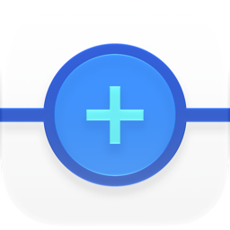
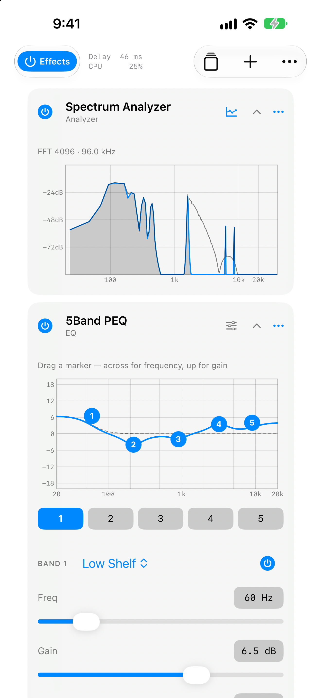

# EffeTune Live

<picture align="right">
  <source media="(prefers-color-scheme: dark)" srcset="docs/icon-dark.png">
  
</picture>

[EffeTune](https://github.com/Frieve-A/effetune) for iOS (Unofficial).

[](https://github.com/satomasahiro2005/effetune-live/releases)
[](#building)

[](LICENSE)

<a href="https://altstore.io/source/nemut.ai/source.json?app=ai.nemut.effetune">
  <picture>
    <source media="(prefers-color-scheme: dark)" srcset="docs/altstore-badge-dark.png">
    
  </picture>
</a>

> **An independent project.** EffeTune Live is built by nemut.ai. It is **not affiliated
> with, endorsed by, or supported by
> [EffeTune](https://github.com/Frieve-A/effetune) or its author (Frieve-A / Yoshiyuki
> Kobayashi).** It bundles EffeTune's DSP core under the MIT license and says so.
>
> Send anything about this app to nemut.ai, not to EffeTune. Do not open issues about it
> on the EffeTune repository. If an official iOS version appears, this app stops shipping.



**Effects for any player on your phone.** Anything with a transport in Control Center,
the Now Playing kind, goes through the chain: it takes that audio, runs it through
EffeTune's effects, and sends it to the built-in speaker. No virtual cable, no input
device to configure. Pick **EffeTune** as the output in Control Center and that is the
whole setup.

Whether a given player keeps the route is a separate matter, and the next section is
about that.

```
Spotify / a podcast app / Safari
  ↓ pick EffeTune as the output in Control Center
extension (Media Device Extension)   ← receives
  ↓ 127.0.0.1:47101
app                                  ← runs EffeTune's DSP
  ↓
built-in speaker
```

## Picking it, and keeping it

The one most people hit first is **Spotify with Canvas turned on.** Canvas is the short
looping video behind some tracks. While one is playing the session counts as video
output, and iOS sends the route to AirPlay instead of here. That shows up as
"Unable to Connect", or as a route that drops a few tracks in.

**Spotify does not have to be on screen.** The Canvas is decided per track whether the
app is in front or in the background, so it fails on the tracks that happen to have one
and works on the tracks that do not, with nothing on screen to explain why. Turning
Canvas off in Spotify's settings removes it.

The rest of it is the general rule. iOS decides whether to hand the audio to a
third-party output device every time the device is activated, and it re-activates
whenever playback stops and starts. If the decision goes the wrong way the system spends
1.5 seconds looking for an AirPlay receiver instead, finds none, and puts the route back
on the speaker.

What makes the decision go the right way, in the order the system checks them:

- the playing app lists this app's protocol identifier in `MDESupportedProtocols`
  (no third-party app does)
- the playing app sets `MDESupportsUniversalURLPlayback` in its `Info.plist`
  (Safari does, which is why audio from a page is allowed through)
- **music is actually playing**: the system keeps a music voice-activity detector while
  it is, and its presence alone is enough to allow the route
- the playing app is a long-form video app with `AVPlayer.allowsExternalPlayback` set
  to `false`

In practice the third one is what carries it. Pick EffeTune Live while music is playing,
not while it is paused. Pausing and resuming re-activates the device, and if the detector
is gone at that moment the route drops back to the speaker. That is also why a Canvas
track can take the route away in the middle of a listening session.

None of the arguments `MediaOutputDevice` takes are read when that decision is made, so
there is nothing on this side to set.

## The iOS 27 Media Device Extension

iOS 27 added `MediaDevice.framework`, which lets an app present itself as an output
device the way an AirPlay speaker does. EffeTune Live advertises itself that way, and
once it is picked the system hands it the audio as samples.

It runs as two processes. The extension advertises the device and receives the audio;
the app processes it and plays it. They are split because the extension's sandbox denies
files, shared memory and `bind`. Outbound connections are allowed, so the audio goes over
a single TCP connection to the app. It ships as one app, and the user installs one app.

Signing the app itself with `com.apple.developer.media-device-extension` stops it from
opening an `AVAudioSession`: every category fails with `'!pla'`. The check only looks at
whether the entitlement's array is empty, so the app carries an empty array and the
extension carries the protocol identifier. That also gets past App Store Connect's
ITMS-91183.

## Building

```bash
git clone --recurse-submodules https://github.com/satomasahiro2005/effetune-live
cd effetune-live
bash Scripts/build.sh          # build and install on the attached device
```

To open it in Xcode, generate first. The `.xcodeproj` is not tracked; `project.yml` is the
source.

```bash
bash Scripts/setup.sh
open EffeTuneLive.xcodeproj
```

You need:

- macOS with Xcode 27 or later
- A device running iOS 27 or later. The extension needs iOS 27, so no audio flows in the simulator
- Apple Developer Program membership (set `DEVELOPMENT_TEAM` in `project.yml` to yours)
- `xcodegen` and python3 3.10+ from Homebrew

The script finds the attached device. With more than one, use
`DEV_ID=<UDID> bash Scripts/build.sh`.

### Building under your own Apple ID

Change the bundle IDs to yours, then create the following in the Apple Developer portal.

1. A **Media Device Sharing Extension** identifier (Identifiers > new). There is no review
2. Put that value in the extension's entitlements and in `UTExportedTypeDeclarations` in
   its Info.plist. The entitlement value must be an array with one element; a bare string
   stops the extension from launching
3. App IDs for the app and the extension

## License

MIT. See [NOTICE.md](NOTICE.md) for what is bundled.
