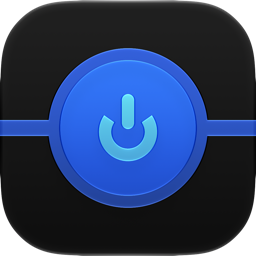
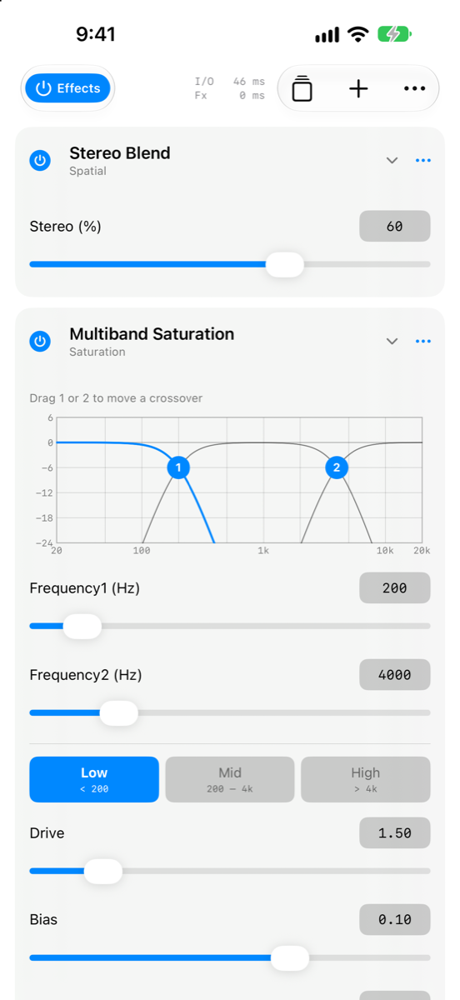
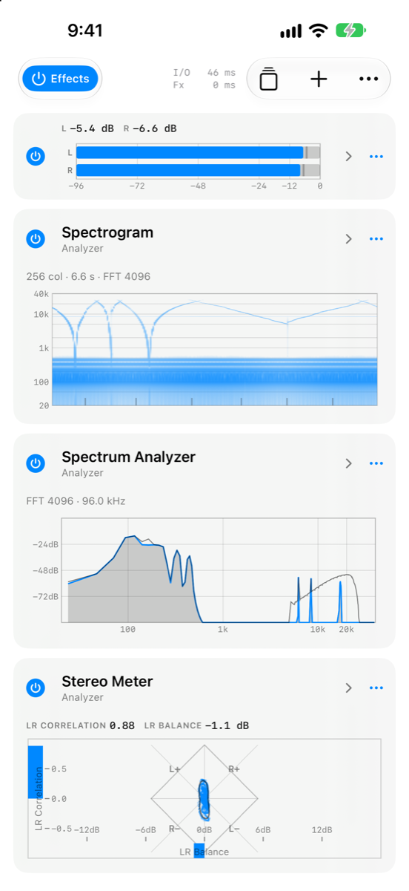
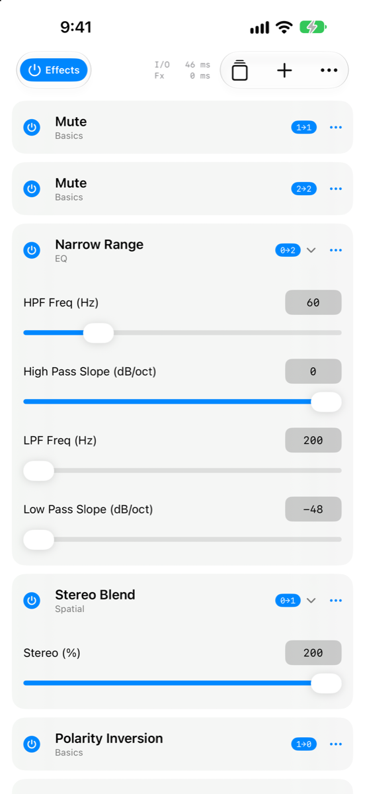

<div align="center">


&nbsp;&nbsp;&nbsp;&nbsp;


# EffectDeck

**Effects for any player on your phone**

[](https://github.com/satomasahiro2005/effectdeck/releases)
[](#building)

[](LICENSE)

<p>
  
  
  
</p>

</div>

> **An independent project.** EffectDeck is built by nemut.ai. It is **not affiliated
> with, endorsed by, or supported by
> [EffeTune](https://github.com/Frieve-A/effetune) or its author (Frieve-A / Yoshiyuki
> Kobayashi).** It bundles EffeTune's DSP core under the MIT license and says so.
>
> Send anything about this app to nemut.ai, not to EffeTune. Do not open issues about it
> on the EffeTune repository. If an official iOS version appears, this app stops shipping.

**Effects for any player on your phone.** Anything with a transport in Control Center,
the Now Playing kind, goes through the chain: it takes that audio, runs it through
EffeTune's effects, and sends it to the built-in speaker. No virtual cable, no input
device to configure. Pick **EffectDeck** as the output in Control Center and that is the
whole setup.

```
Spotify / a podcast app / Safari
  ↓ pick EffectDeck as the output in Control Center
extension (Media Device Extension)   ← receives
  ↓ 127.0.0.1:47101
app                                  ← runs EffeTune's DSP
  ↓
built-in speaker
```

## If it says Unable to Connect

Almost always **Spotify with Canvas on.** Canvas is the short looping video behind some
tracks, and while one plays the session counts as video output, so iOS sends the route to
AirPlay instead of here. It fails on the tracks that have a Canvas and works on the ones
that do not, and Spotify does not have to be on screen for it. Turn Canvas off in
Spotify's settings.

Otherwise, **pick EffectDeck while music is playing, not while it is paused.** iOS decides
whether a third-party output device gets the audio each time the device is activated, and
it re-activates whenever playback stops and starts. What carries it in practice is the
system's music voice-activity detector, which is only up while music plays. The other ways
in are `MDESupportedProtocols` (no third-party app lists us) and
`MDESupportsUniversalURLPlayback` (Safari sets it, which is why audio from a page gets
through). When the decision goes the other way the system spends 1.5 seconds looking for
an AirPlay receiver, finds none, and puts the route back on the speaker.

None of the arguments `MediaOutputDevice` takes are read when that decision is made, so
there is nothing on this side to set.

## The iOS 27 Media Device Extension

iOS 27 added `MediaDevice.framework`, which lets an app present itself as an output
device the way an AirPlay speaker does. EffectDeck advertises itself that way, and
once it is picked the system hands it the audio as samples.

It runs as two processes. The extension advertises the device and receives the audio;
the app processes it and plays it. They are split because the extension's sandbox denies
files, shared memory and `bind`. Outbound connections are allowed, so the audio goes over
a single TCP connection to the app. It ships as one app, and the user installs one app.

Signing the app itself with `com.apple.developer.media-device-extension` stops it from
opening an `AVAudioSession`: every category fails with `'!pla'`. The check only looks at
whether the entitlement's array is empty, so the app carries an empty array and the
extension carries the protocol identifier. That also gets past App Store Connect's
ITMS-91183.

## Building

```bash
git clone --recurse-submodules https://github.com/satomasahiro2005/effectdeck
cd effectdeck
bash Scripts/build.sh          # build and install on the attached device
```

To open it in Xcode, generate first. The `.xcodeproj` is not tracked; `project.yml` is the
source.

```bash
bash Scripts/setup.sh
open EffeTuneLive.xcodeproj
```

You need:

- macOS with Xcode 27 or later
- A device running iOS 27 or later. The extension needs iOS 27, so no audio flows in the simulator
- Apple Developer Program membership (set `DEVELOPMENT_TEAM` in `project.yml` to yours)
- `xcodegen` and python3 3.10+ from Homebrew

The script finds the attached device. With more than one, use
`DEV_ID=<UDID> bash Scripts/build.sh`.

### Building under your own Apple ID

Change the bundle IDs to yours, then create the following in the Apple Developer portal.

1. A **Media Device Sharing Extension** identifier (Identifiers > new). There is no review
2. Put that value in the extension's entitlements and in `UTExportedTypeDeclarations` in
   its Info.plist. The entitlement value must be an array with one element; a bare string
   stops the extension from launching
3. App IDs for the app and the extension

## License

MIT. See [NOTICE.md](NOTICE.md) for what is bundled.
