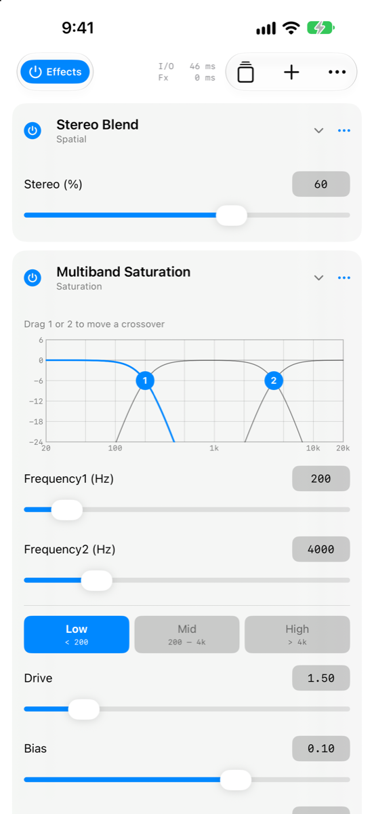
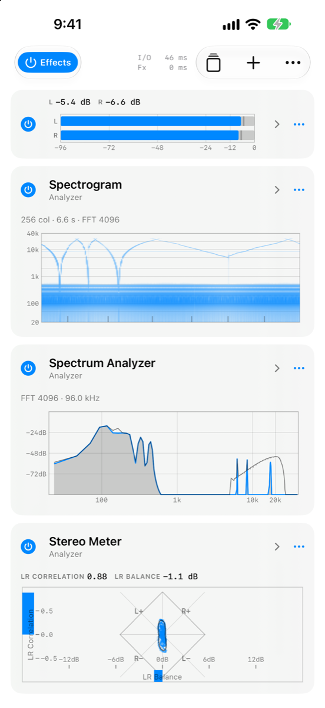
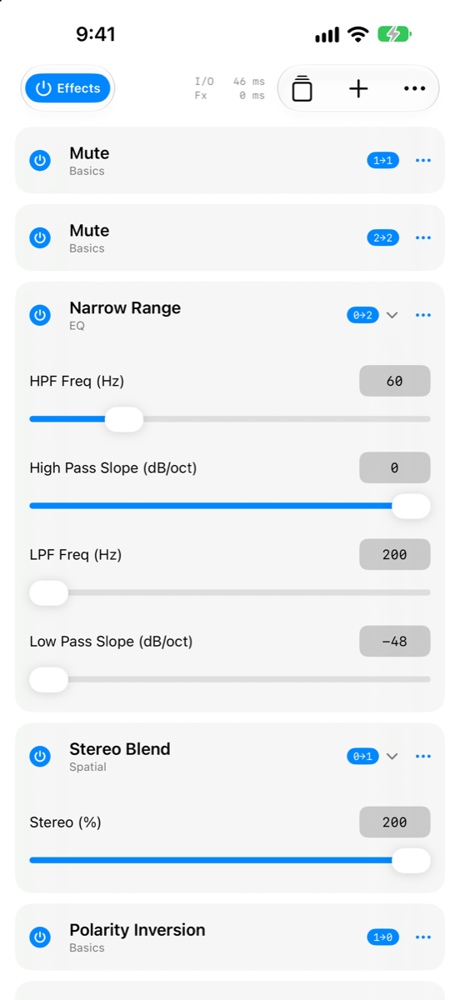

<div align="center">


&nbsp;&nbsp;&nbsp;&nbsp;


# EffectDeck

**Effects for any player on your phone**

Free and open source under the [MIT license](LICENSE).

Website: [effectdeck.nemut.ai](https://effectdeck.nemut.ai/)

[](https://github.com/satomasahiro2005/EffectDeck/releases)
[](#building)

[](LICENSE)
[](https://fxdB.nemut.ai/)

<a href="https://apps.apple.com/app/effectdeck/id6812467517">
  <!-- 高さではなく幅で指定する。GitHub は img に height:auto を注入するので
       height 属性は効かず、max-height が上限になるだけ。119.66:40 の比で
       幅 180 が高さ 60。 -->
  
</a>

<!-- バッジの下に余白を空ける。Apple はバッジの高さの 1/4 を空けろと言う
     （180px 幅なら高さ 60.2px なので 15.1px）。空行では 5.3px しか空かず、
     <br> だけでは次の <p> の margin-top が 0 なので変わらなかった。
     高さを持つ行を 1 つ挟む。 -->
<p>&nbsp;</p>

<p>
  
  
  
</p>

</div>

> **An independent project.** EffectDeck is built by nemut.ai. It is **not affiliated
> with, endorsed by, or supported by
> [EffeTune](https://github.com/Frieve-A/effetune) or its author (Frieve-A / Yoshiyuki
> Kobayashi).** It bundles EffeTune's DSP core under the MIT license and says so.
>
> Send anything about this app to nemut.ai, not to EffeTune. Do not open issues about it
> on the EffeTune repository.

**Effects for any player on your phone.** Anything with a transport in Control Center,
the Now Playing kind, goes through the chain: it takes that audio, runs it through
EffeTune's effects, and plays it on whatever was the output before you picked EffectDeck:
the speaker, wired headphones, AirPods. No virtual cable, no input device to configure.
Pick **EffectDeck** as the output in Control Center and that is the whole setup.

```
Spotify / a podcast app / Safari
  ↓ pick EffectDeck as the output in Control Center
extension (Media Device Extension)   ← receives
  ↓ 127.0.0.1:47101
app                                  ← runs EffeTune's DSP
  ↓
the output you had before (speaker / headphones / AirPods)
```

## If it says Unable to Connect

Almost always **Spotify with Canvas on.** Canvas is the short looping video behind some
tracks. While one plays, the session counts as video output, so iOS sends the route to
AirPlay instead of here, finds no receiver, and puts it back where it was. A track with
Canvas enabled cannot connect to EffectDeck, and Spotify does not have to be on screen for
it. Turn Canvas off in Spotify's settings, then restart Spotify.

Spotify sometimes cannot connect even on a track without a Canvas: when Spotify has a video
(such as a Canvas) loaded, iOS treats it as playing video, even while paused. Restart
Spotify, then connect to EffectDeck again.

Playing a YouTube video may disconnect EffectDeck, depending on YouTube's playback state.
Restart YouTube, then connect to EffectDeck again; the same video usually connects.

Otherwise, try these in order:

1. Restart the player app
2. Restart EffectDeck
3. Restart the iPhone

The decision is made by iOS. None of the arguments `MediaOutputDevice` takes are read
when it is made, so there is nothing on this side to set.

## The iOS 27 Media Device Extension

iOS 27 added `MediaDevice.framework`, which lets an app present itself as an output
device the way an AirPlay speaker does. EffectDeck advertises itself that way, and
once it is picked the system hands it the audio as samples.

It runs as two processes. The extension advertises the device and receives the audio;
the app processes it and plays it. They are split because the extension's sandbox denies
files, shared memory and `bind`. Outbound connections are allowed, so the audio goes over
a single TCP connection to the app. It ships as one app, and the user installs one app.

Signing the app itself with `com.apple.developer.media-device-extension` stops it from
opening an `AVAudioSession`: every category fails with `'!pla'`. The check only looks at
whether the entitlement's array is empty, so the app carries an empty array and the
extension carries the protocol identifier. That also gets past App Store Connect's
ITMS-91183.

To build an app like this, start from
[ios27-media-device-passthrough](https://github.com/satomasahiro2005/ios27-media-device-passthrough):
the same two processes in a handful of files, with a low-pass filter where EffectDeck has
its effects. It is MIT-0, so you can copy it without keeping the copyright notice.

## Writing a JSFX for it

EffectDeck hosts single-file audio JSFX through the portable EEL2 interpreter.
[`JSFX.md`](JSFX.md) is the contract: what is supported, what is
deliberately absent, the rules that reject a file outright, and the resource
limits. It is written to be handed to a language model as-is — the top section
states the requirements in the order they are usually violated, and there is a
checklist to run a generated script against before you try to import it.

In the app, **Write JSFX with ChatGPT** (Plugins, or the Import JSFX menu) opens
ChatGPT with a short request that names the EffectDeck and EffeTune DSP versions, points it at
`JSFX.md`, and asks what you want to build. Import the file it
returns with **Import JSFX → From Files**, or copy the script and use **From Clipboard**.
Use a paid ChatGPT plan: it reads the
linked file and reasons through the code, while the free tier may skip the link and
miss the rules.

The short version: one file, no `import` or `include()`, no filesystem, no MIDI,
`desc:` first, and no JIT — so keep `@sample` cheap.

It describes only the differences, not the language. For JSFX itself, read
REAPER's *JS: Programming Reference* and [JoepVanlier/ysfx](https://github.com/JoepVanlier/ysfx),
which is the interpreter embedded here.

**Build with ChatGPT…** (the top of the Effects list in Available Effects) opens ChatGPT the same way, for a chain of the
built-in effects instead of a script. [`CHAIN.md`](CHAIN.md) is its contract; the effect
names and keys it points to are generated for each EffeTune DSP version under
[`chain/`](chain/). Bring the chain back with **Import from clipboard** in
Presets, or tap the link ChatGPT gives when it can run code.

## Building

```bash
git clone https://github.com/satomasahiro2005/EffectDeck
cd EffectDeck
git submodule update --init Vendor/effetune Vendor/ysfx
bash Scripts/build.sh          # build and install on the attached device
```

Leave out `--recursive`: ysfx's own submodules are not used. Keep the effetune submodule's
full history, not `--depth 1`, because `Tools/gen_version.py` reads its `dsp-v*` tag.

To open it in Xcode, generate first. The `.xcodeproj` is not tracked; `project.yml` is the
source.

```bash
bash Scripts/setup.sh
open EffeTuneLive.xcodeproj
```

You need:

- macOS with Xcode 27 or later
- A device running iOS 27 or later. The extension needs iOS 27, so no audio flows in the simulator
- Apple Developer Program membership (set `DEVELOPMENT_TEAM` in `project.yml` to yours)
- `xcodegen` and python3 3.10+ from Homebrew

The script finds the attached device. With more than one, use
`DEV_ID=<UDID> bash Scripts/build.sh`. The log goes to `build.log`; look for
`BUILD SUCCEEDED` there.

Run `Scripts/build.sh` from Terminal in the Mac's own login session, not over SSH. Over SSH
codesign cannot reach the keychain, and signing the extension fails with
`errSecInternalComponent`. The compile still succeeds, so an unsigned `out/EffectDeck.app`
appears and the install then fails with "not a valid bundle".

### Building under your own Apple ID

Set `DEVELOPMENT_TEAM` in `project.yml` to your team, change the identifiers below to your
own, and create them in the Apple Developer portal.

| What | Today's value | Where it is written |
|---|---|---|
| App ID for the app | `ai.nemut.effetune` | `project.yml` (`EffeTuneLive` target) |
| App ID for the Media Device extension | `ai.nemut.effetune.extension` | `project.yml` (`EffeTuneLiveExtension`) |
| App ID for the share extension | `ai.nemut.effetune.share` | `project.yml` (`EffectDeckShare`) |
| Media Device Sharing Extension identifier | `media-device-protocol.ai.nemut.effetune` | `Sources/Extension/Extension.entitlements`, `UTExportedTypeDeclarations` in `Sources/Extension/Info.plist`, and `kProtocolID` in `Sources/Extension/EffeTuneLiveExtension.swift` |
| App Group | `group.ai.nemut.effetune` | all three `.entitlements` files and `ETShareInbox.group` in `Sources/EffeTuneLive/DSP/ETShareInbox.swift` |
| iCloud key-value storage | follows the app's bundle ID | `Sources/EffeTuneLive/EffeTuneLive.entitlements` |
| Associated Domains | `applinks:effectdeck.nemut.ai` | `Sources/EffeTuneLive/EffeTuneLive.entitlements` |

- The Media Device Sharing Extension identifier is made under Identifiers > new. There is
  no review. The entitlement value must be an array with one element; a bare string stops
  the extension from launching. Change all three places together: the extension offers
  `kProtocolID` as its protocol type, and it must match the entitlement.
- `Tools/check_release_binary.py` checks a release archive against today's values
  (`BUNDLES`, `APP_GROUP` and `APPLINKS` at the top of the file). Change them there too if
  you use it.
- The app itself carries `com.apple.developer.media-device-extension` as an **empty**
  array. Leave it empty (see **The iOS 27 Media Device Extension** above).
- Enable App Groups on all three App IDs, iCloud (key-value storage only) on the app, and
  Associated Domains on the app.
- Share links only open the app if the domain serves an `apple-app-site-association` that
  names your app. `site/` serves it for `effectdeck.nemut.ai`. Without a domain of your
  own, remove the Associated Domains key; links then open in the browser.

## Working on the code

### Names

The app is **EffectDeck**. The project, the targets and many files still carry its first
name, EffeTune Live: `EffeTuneLive.xcodeproj`, the `EffeTuneLive` app target (product name
`EffectDeck`), `EffeTuneLiveExtension`, `Sources/EffeTuneLive`. They are the same app.
"EffeTune" alone means the upstream project in `Vendor/effetune`.

### What is pinned and patched

| Path | What it is |
|---|---|
| `Vendor/effetune` | EffeTune, pinned by the submodule. Its `dsp/` is the audio engine |
| `Vendor/ysfx` | ysfx, the JSFX interpreter, pinned to `5c3452fe`. `Scripts/setup.sh` refuses another revision |
| `Patches/abi-begin-ptr.diff` | Adds `et_instance_asset_begin_ptr`, a 64-bit staging pointer. Without it the seven effects that load data (IR Reverb and the ones designed in the app, such as Room EQ) pass audio through silently |
| `Patches/effetune-external-*.diff` | Let AUv3 and JSFX run as nodes inside the EffeTune chain ([docs/external-processor.md](docs/external-processor.md)) |
| `Patches/ysfx-effectdeck-ios.diff` | The iOS sandbox for ysfx and fixes taken from upstream WDL |
| `Patches/ysfx-effectdeck-ios.old.diff` | The previous ysfx patch. Never applied; setup.sh uses it to take the old version off a copied tree |

`Scripts/setup.sh` applies the patches to the submodule working trees, regenerates the
effect catalog and presets from `Vendor/effetune`, and runs xcodegen. The patched
submodule trees are never committed; the patches are. [`docs/`](docs/README.md) lists the
design documents and notes.

### Tests

None of these need a device or a paid account. [CONTRIBUTING.md](CONTRIBUTING.md#running-the-tests)
has the exact commands.

| Suite | Runs on | Command |
|---|---|---|
| Logic tests (all of `Tests/Unit`, JSFX included) | Mac with Xcode, simulator | `bash Scripts/test.sh`, or the `Logic` scheme in Xcode |
| The Foundation-only part of the Logic tests | Linux or WSL with Swift | `bash Tests/Linux/run.sh --name local` |
| Native C tests (`Tests/Native`) | Linux, macOS or WSL with CMake | `cd Tests/Native && cmake --preset asan && cmake --build --preset asan && ctest --preset asan` |
| Website (`site/`) | Node 22 | `cd site && npm ci && npm test` |
| Generators and checks (`Tools/`, `Tests/Tools`) | Python 3.10+ and Node 22, any OS | `python3 -m unittest discover -s Tests/Tools` |
| UI tests (`Tests/UI`) | Mac with Xcode, simulator | `bash Scripts/uitest.sh MenuProbe` (one class; see CONTRIBUTING) |

GitHub Actions runs all of them but the UI tests, and checks that generated files are up to
date, on every push to `main` and every pull request ([CI](CONTRIBUTING.md#ci)).

### Launch arguments

For the simulator and for debugging. They are read from `UserDefaults`, so they are passed
as `-Name value` to `xcrun simctl launch`, `xcrun devicectl device process launch` or an
XCUITest `launchArguments`. The icon on the home screen passes none.

| Argument | What it does |
|---|---|
| `-ETSeed <name>` | Starts with a prepared chain instead of the saved one, every card open. `none`, `peq`, `compressor`, `saturation`, `meter`, `spectrum`, `peq-spectrum`, `chain`, `store`, `analyzers4`; a factory preset by short name (`vinyl`, `karaoke`, `analyzers`, `live`, `tube`, `bbe`, `fmradio`); `demo` in Debug builds; anything else is read as plugin type names separated by commas |
| `-ETMock 1` | Feeds a generated test signal, so meters and graphs move without the extension |
| `-ETWidth <pt>` | With `-ETSeed`, the width of the one-column chain, so screenshots taken on iPad look like a phone. Default 393; `0` keeps the device width |
| `-ETLayout wide` | With `-ETSeed`, keeps the two-column iPad layout instead of one column |
| `-ETCollapsed 1` | With `-ETSeed`, starts with every card closed. A card with a graph still shows the graph |
| `-ETSheet <name>` | Opens a sheet at launch: `picker`, `settings`, `routing`, `presets`, `ir`, `tips` |
| `-ETAutoExpand 1`, `-ETAutoExpandIndex <n>` | Taps an effect once, 4 seconds after launch, to record the animation. A tap moves the card one step (open → graph only → folded → open), so it opens only a folded card, and a card that `-ETSeed` opened keeps only its graph. The first effect by default; `n` counts from 0 and skips Sections |
| `-ETDebugBlocks 1` | Tints each Section block to check grouping |
| `-ETDiag 1` | Adds a hidden `diag` text with the active node count and chain length, for UI tests |
| `-ETConsole 1` | Also prints the diagnostic log to stdout, for `devicectl ... --console` |
| `-ETNowPlaying on\|off\|first` | Whether the app claims Now Playing (default `off`). Debug builds save it to `UserDefaults` and keep it on later launches until another value is passed; Release builds use it for that launch only |
| `-ETProbe 1` | Shows the reorder probe screen instead of the app |
| `-pref.<key> <value>` | Overrides a setting for that launch, for example `-pref.power balanced` |

## License

Free and open source under the MIT license. Everything bundled in the app is open source
too; [NOTICE.md](NOTICE.md) lists each part and its license.
